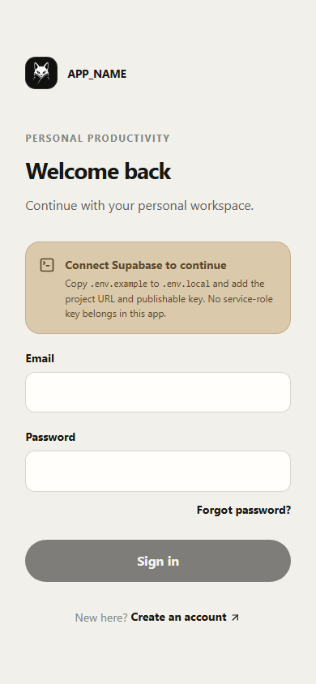
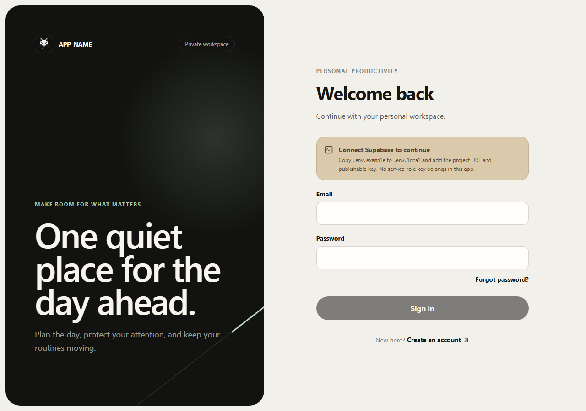
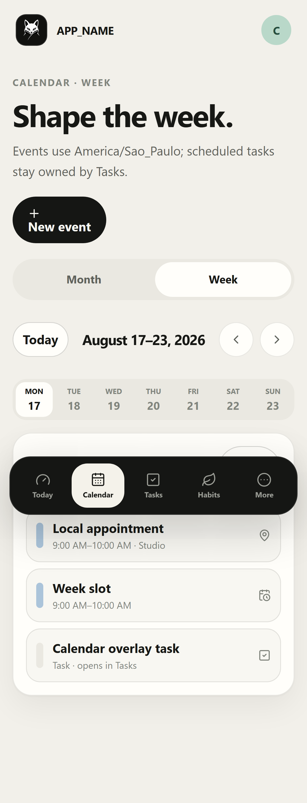
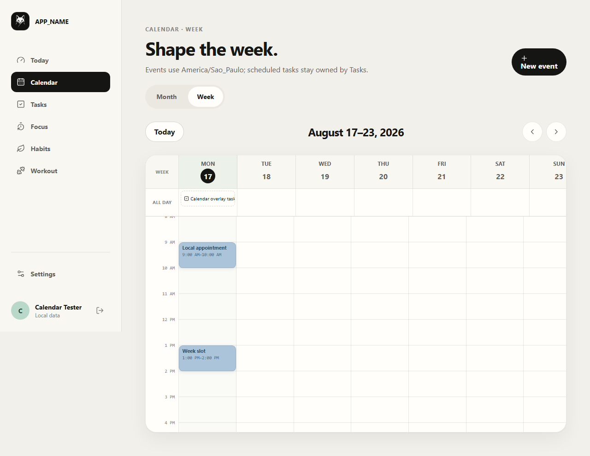
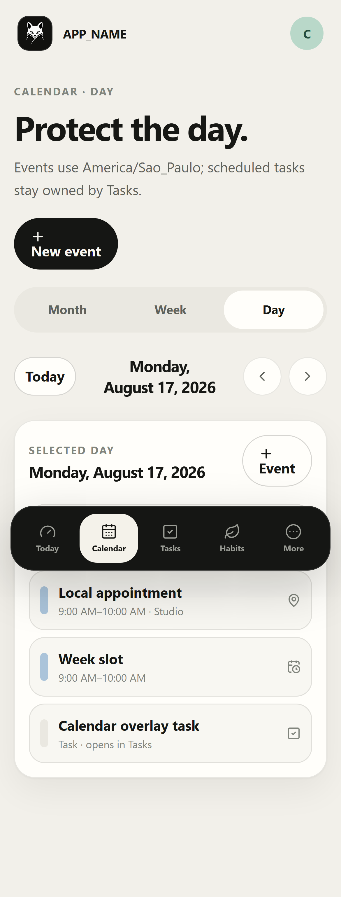
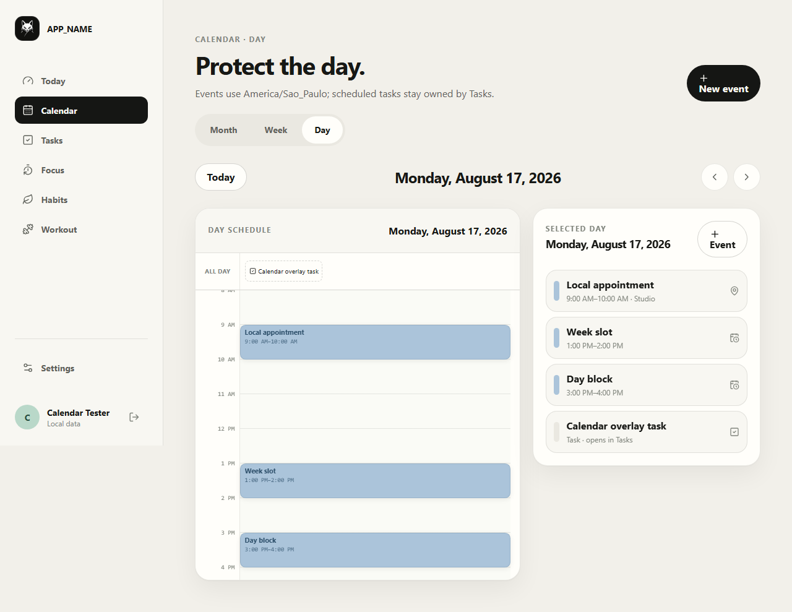
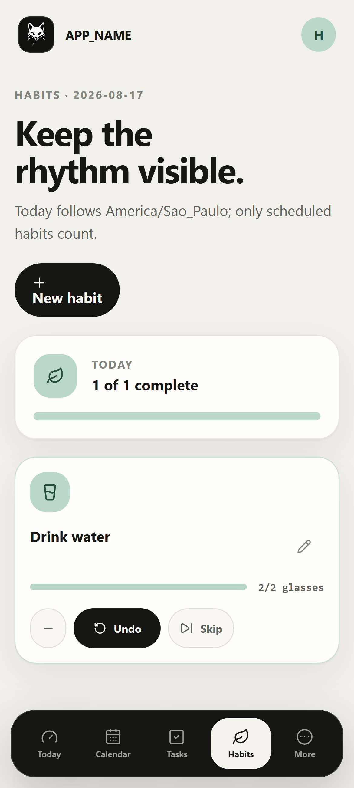
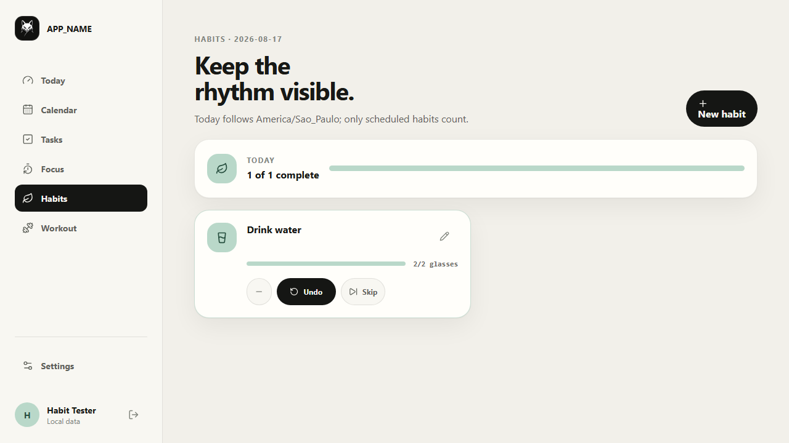
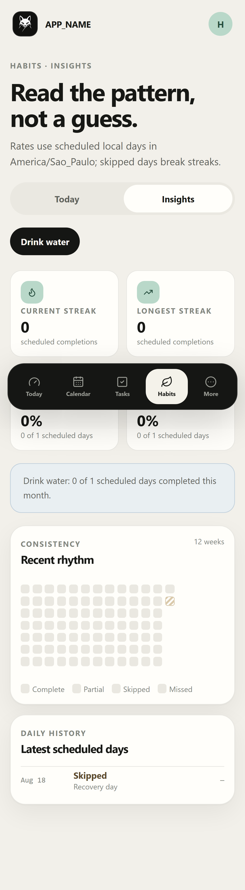
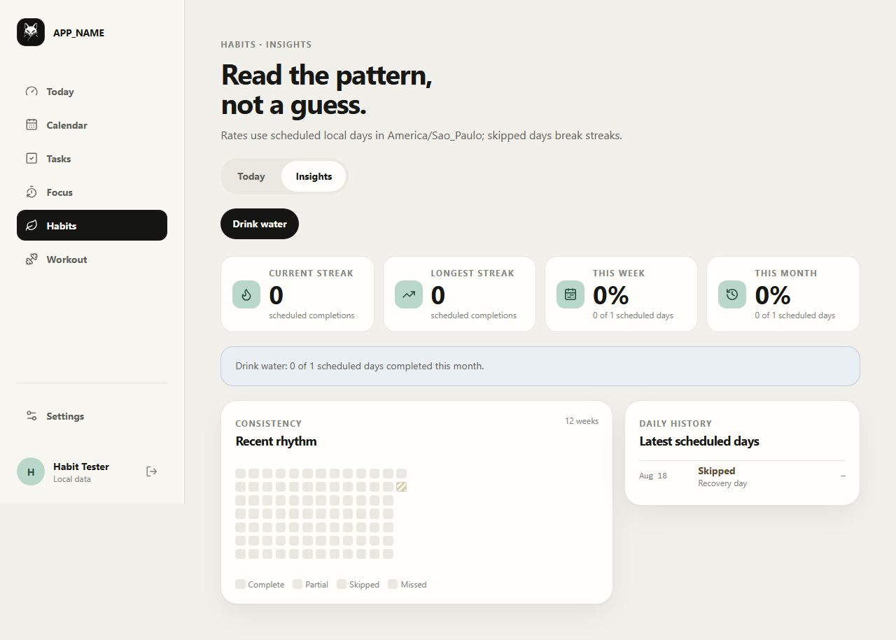

# Design system

## Identity premise

The supplied geometric fox is the identity anchor. It is not used as permission to invent a final brand name. Its crisp silhouette, black/ivory contrast and crossed diagonal lower stroke inform the UI in three controlled ways:

1. black or ivory brand surfaces with restrained contrast;
2. an occasional diagonal rule in hero surfaces;
3. precise iconography inside soft, tactile layouts.

The fox mark appears in authentication, app navigation, loading and PWA identity. It should not be repeated decoratively on every card.

## Color tokens

| Role | Light | Dark |
| --- | --- | --- |
| Canvas | `#f2f0ea` | `#10110f` |
| Raised canvas | `#f8f7f2` | `#161714` |
| Surface | `#fffefa` | `#1b1c19` |
| Primary ink | `#171815` | `#f5f3ec` |
| Muted ink | `#5f625b` | `#b9b9b2` |
| Mint | `#b9d8c9` | `#789f8e` |
| Coral | `#e8aa95` | `#b97b68` |
| Blue | `#abc4da` | `#7894ad` |
| Sand | `#dac9aa` | `#a39171` |

Accents carry hierarchy, not arbitrary decoration. Status never relies on color alone.

## Typography

System sans is `-apple-system, BlinkMacSystemFont, "SF Pro Display", "Segoe UI", sans-serif`. Large headings use a slightly tight letter-spacing and 0.95–1.05 line height. Body copy stays at 1.6. Timers and metrics may use `ui-monospace`.

The responsive scale runs from 12 px eyebrow copy through 64 px desktop display copy using `clamp()`. Short English interface copy remains centralized in config or feature copy modules.

## Spacing and radii

- Base spacing step: 4 px; common gaps are 8, 12, 16, 20, 24, 32, 40 and 48 px.
- Touch target: minimum 44×44 px.
- Controls: 12 px radius.
- Standard cards: 18–24 px.
- Hero surfaces and sheets: up to 32 px.
- Capsule navigation/buttons: full pill.

Not every region becomes a card. Page headers, lists and navigation use whitespace or a fine divider where a container adds no hierarchy.

## Shadows and borders

Borders are one pixel and low contrast. Standard cards use a two-part soft shadow; floating mobile navigation and update prompts use a deeper shadow. Dark theme reduces bright borders and lets elevation come from surface contrast.

## Interaction states

- Motion: 160–200 ms with a decelerating curve.
- Hover: subtle surface shift or up to 3 px lift for large destination cards.
- Press: scale to `0.98`.
- Keyboard: visible 3 px focus ring with offset.
- Disabled: retains label and structure at 52% opacity.
- Reduced motion: animation and transitions collapse to effectively zero.

## Components

### Buttons

Primary is inverse ink/ivory and pill-shaped. Secondary is a bordered surface. Quiet is text on transparent. Loading keeps the action label and adds a spinning progress icon.

### Inputs

Every field has a real label, 50 px control height, hint/error slot and focus ring. Error changes border and exposes an `aria-describedby` message.

### Chips

Chips are reserved for filters, compact metadata and view switches. They are not used as a replacement for every button.

### Cards

Large cards have one purpose, a clear text hierarchy and optional single destination. Bento cards vary in size; uniform tile walls are avoided.

### Sheets and dialogs

Complex mobile flows become bottom sheets or dedicated pages. Destructive dialogs need explicit confirmation, focus containment and focus return. These headless interaction primitives will be introduced only with the first feature that needs them.

### Charts

Use real values, visible labels/tooltips and accessible summaries. Prefer a baseline plus one accent series. Never add smoothing that implies false precision; workout progression charts must distinguish load, volume and estimated 1RM.

## Responsive navigation

- `<768 px`: floating dark capsule with Today, Calendar, Tasks, Habits and More; safe-area aware.
- `768–1088 px`: compact persistent rail; content uses tablet-specific columns.
- `>1088 px`: labeled sidebar and full-width bento hierarchy.

Focus and Workout remain first-level routes; mobile reaches them through More and contextual links.

## Initial screen capture checklist

- [x] Login at 390×844, light — [capture](assets/screens/login-mobile-light.png).
- [x] Login at 1280×900, light — [capture](assets/screens/login-desktop-light.png).
- [x] Calendar Week at 390×844, light — [capture](assets/screens/calendar-week-mobile-light.png).
- [x] Calendar Week at 1280×900, light — [capture](assets/screens/calendar-week-desktop-light.png).
- [x] Calendar Day at 390×844, light — [capture](assets/screens/calendar-day-mobile-light.png).
- [x] Calendar Day at 1280×900, light — [capture](assets/screens/calendar-day-desktop-light.png).
- [x] Habits Today at 390×844, light — [capture](assets/screens/habits-today-mobile-light.png).
- [x] Habits Today at 1280×720, light — [capture](assets/screens/habits-today-desktop-light.png).
- [x] Habits Insights at 390×844, light — [capture](assets/screens/habits-insights-mobile-light.png).
- [x] Habits Insights at 1280×900, light — [capture](assets/screens/habits-insights-desktop-light.png).
- [ ] Authenticated Today at 390×844, light/dark (requires a real local Supabase session).
- [ ] Authenticated Today at 1280×900, light/dark (requires a real local Supabase session).

Captured images belong under `docs/assets/screens/` and should be refreshed at phase boundaries. The foundation does not bypass AuthGuard merely to manufacture an authenticated screenshot.

### Foundation captures

### Calendar captures

### Habits captures

